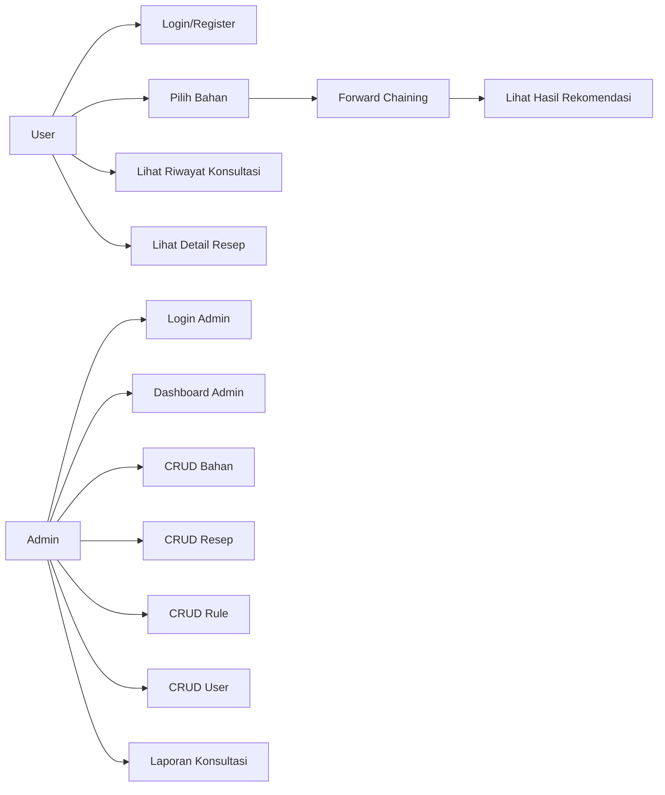
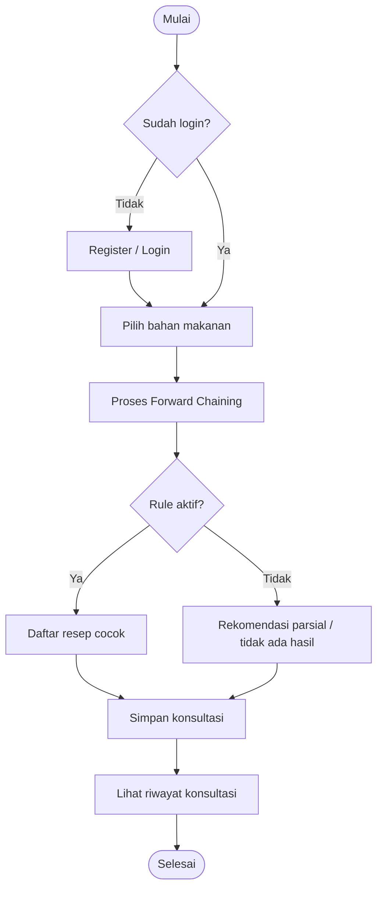
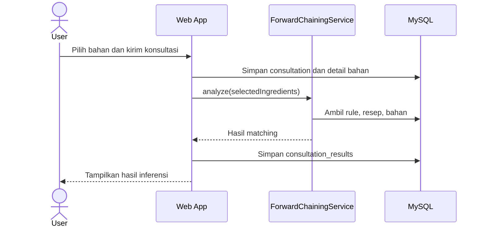
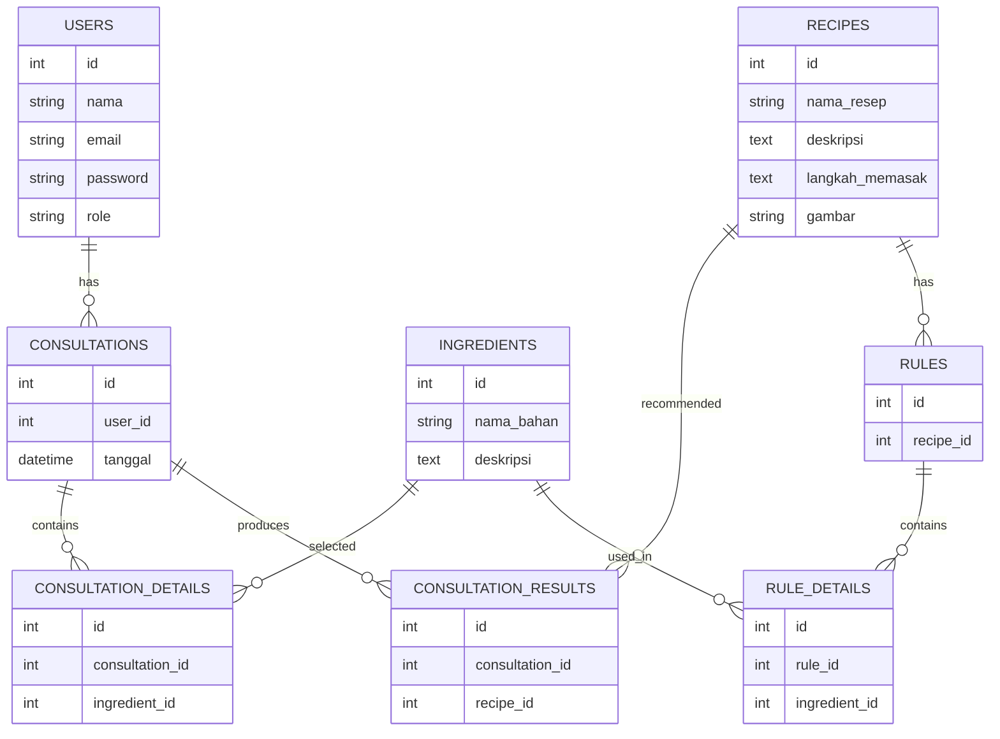
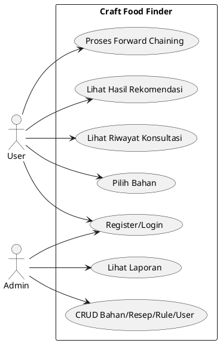
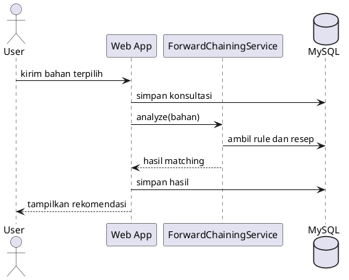
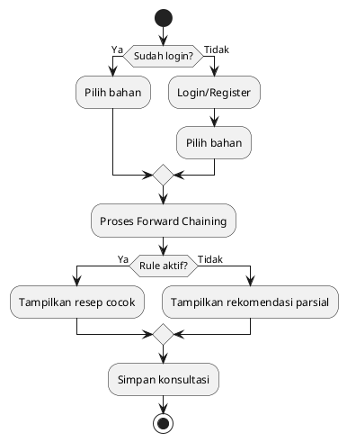

# UML Craft Food Finder

## Use Case Diagram

```mermaid
flowchart LR
    U[User] --> L[Login/Register]
    U --> C[Pilih Bahan]
    C --> F[Forward Chaining]
    F --> R[Lihat Hasil Rekomendasi]
    U --> H[Lihat Riwayat Konsultasi]
    U --> D[Lihat Detail Resep]
    A[Admin] --> AL[Login Admin]
    A --> AD[Dashboard Admin]
    A --> MB[CRUD Bahan]
    A --> MR[CRUD Resep]
    A --> MRule[CRUD Rule]
    A --> MU[CRUD User]
    A --> LP[Laporan Konsultasi]
```

## Activity Diagram

```mermaid
flowchart TD
    Start([Mulai]) --> Login{Sudah login?}
    Login -- Tidak --> Reg[Register / Login]
    Reg --> Pilih[Pilih bahan makanan]
    Login -- Ya --> Pilih
    Pilih --> Proses[Proses Forward Chaining]
    Proses --> Cek{Rule aktif?}
    Cek -- Ya --> Hasil[Daftar resep cocok]
    Cek -- Tidak --> Saran[Rekomendasi parsial / tidak ada hasil]
    Hasil --> Simpan[Simpan konsultasi]
    Saran --> Simpan
    Simpan --> Riwayat[Lihat riwayat konsultasi]
    Riwayat --> End([Selesai])
```

## Sequence Diagram

```mermaid
sequenceDiagram
    actor User
    participant Web as Web App
    participant Service as ForwardChainingService
    participant DB as MySQL

    User->>Web: Pilih bahan dan kirim konsultasi
    Web->>DB: Simpan consultation dan detail bahan
    Web->>Service: analyze(selectedIngredients)
    Service->>DB: Ambil rule, resep, bahan
    Service-->>Web: Hasil matching
    Web->>DB: Simpan consultation_results
    Web-->>User: Tampilkan hasil inferensi
```

## ERD

```mermaid
erDiagram
    USERS ||--o{ CONSULTATIONS : has
    CONSULTATIONS ||--o{ CONSULTATION_DETAILS : contains
    CONSULTATIONS ||--o{ CONSULTATION_RESULTS : produces
    INGREDIENTS ||--o{ CONSULTATION_DETAILS : selected
    RECIPES ||--o{ CONSULTATION_RESULTS : recommended
    RECIPES ||--o{ RULES : has
    RULES ||--o{ RULE_DETAILS : contains
    INGREDIENTS ||--o{ RULE_DETAILS : used_in

    USERS {
        int id
        string nama
        string email
        string password
        string role
    }

    INGREDIENTS {
        int id
        string nama_bahan
        text deskripsi
    }

    RECIPES {
        int id
        string nama_resep
        text deskripsi
        text langkah_memasak
        string gambar
    }

    RULES {
        int id
        int recipe_id
    }

    RULE_DETAILS {
        int id
        int rule_id
        int ingredient_id
    }

    CONSULTATIONS {
        int id
        int user_id
        datetime tanggal
    }

    CONSULTATION_DETAILS {
        int id
        int consultation_id
        int ingredient_id
    }

    CONSULTATION_RESULTS {
        int id
        int consultation_id
        int recipe_id
    }
```

## PlantUML

### Use Case

```plantuml
@startuml
left to right direction
actor User
actor Admin
rectangle "Craft Food Finder" {
  usecase "Register/Login" as UC1
  usecase "Pilih Bahan" as UC2
  usecase "Proses Forward Chaining" as UC3
  usecase "Lihat Hasil Rekomendasi" as UC4
  usecase "Lihat Riwayat Konsultasi" as UC5
  usecase "CRUD Bahan/Resep/Rule/User" as UC6
  usecase "Lihat Laporan" as UC7
}
User --> UC1
User --> UC2
User --> UC3
User --> UC4
User --> UC5
Admin --> UC1
Admin --> UC6
Admin --> UC7
@enduml
```

### Sequence

```plantuml
@startuml
actor User
participant "Web App" as Web
participant "ForwardChainingService" as Service
database MySQL

User -> Web : kirim bahan terpilih
Web -> MySQL : simpan konsultasi
Web -> Service : analyze(bahan)
Service -> MySQL : ambil rule dan resep
Service --> Web : hasil matching
Web -> MySQL : simpan hasil
Web --> User : tampilkan rekomendasi
@enduml
```

### Activity

```plantuml
@startuml
start
if (Sudah login?) then (Ya)
  :Pilih bahan;
else (Tidak)
  :Login/Register;
  :Pilih bahan;
endif
:Proses Forward Chaining;
if (Rule aktif?) then (Ya)
  :Tampilkan resep cocok;
else (Tidak)
  :Tampilkan rekomendasi parsial;
endif
:Simpan konsultasi;
stop
@enduml
```
